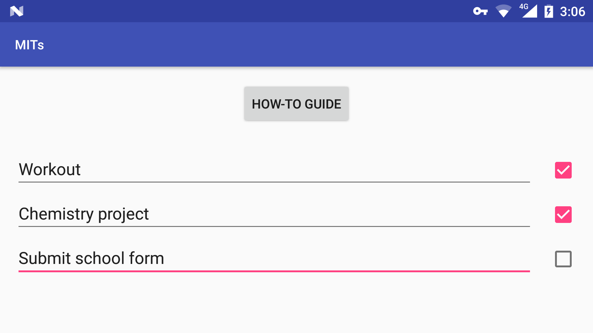

# Most Important Tasks

Android productivity app for Leo Babauta's modified idea of [MITs](https://zenhabits.net/purpose-your-day-most-important-task/). This application has been made because there was no Android app for the concept of most important tasks; and even though the idea seems simple enough, actually noting down, seeing, and crossing off tasks works significantly better than keeping it in your head.

This app has been made using Android and Java.

This project has been deprecated because [time bend](https://gitlab.com/neelkamath/time-bend-android) is better (even I don't use this app anymore).

## Installation

### Prerequisites

- [Android Studio](https://developer.android.com/studio/index.html)

### Installing

Clone the repository:
- HTTPS: `git clone https://github.com/neelkamath/most-important-tasks.git`
- SSH: `git clone git@github.com:neelkamath/most-important-tasks.git`

## Usage

1. Open `most-important-tasks-android` in Android Studio.
1. Click **Run > Run 'app'**.
1. [Run](https://developer.android.com/training/basics/firstapp/running-app) the app.

# Documentation

## `SharedPreferences`

[`SharedPreferences`](https://developer.android.com/reference/android/content/SharedPreferences.html) are gotten with [`Context.MODE_PRIVATE`](https://developer.android.com/reference/android/content/Context.html#MODE_PRIVATE).

|File|Explanation|
|----|-----------|
|`mits`|The user's MIT status.|

### `mits`

|Key|Data type|Explanation|Example|
|---|---------|-----------|-------|
|`mit1`|`String`|The first MIT.|`"exercise 30 minutes"`|
|`mit2`|`String`|The second MIT.|`"cleanup wardrobe"`|
|`mit3`|`String`|The third MIT.|`"fix website bug"`|
|`mit1CheckBox`|`boolean`|This will be `true` if the MIT has been completed and `false` otherwise.|`true`|
|`mit2CheckBox`|`boolean`|This will be `true` if the MIT has been completed and `false` otherwise.|`true`|
|`mit3CheckBox`|`boolean`|This will be `true` if the MIT has been completed and `false` otherwise.|`false`|

# License

This project is licensed under the [MIT License](LICENSE).